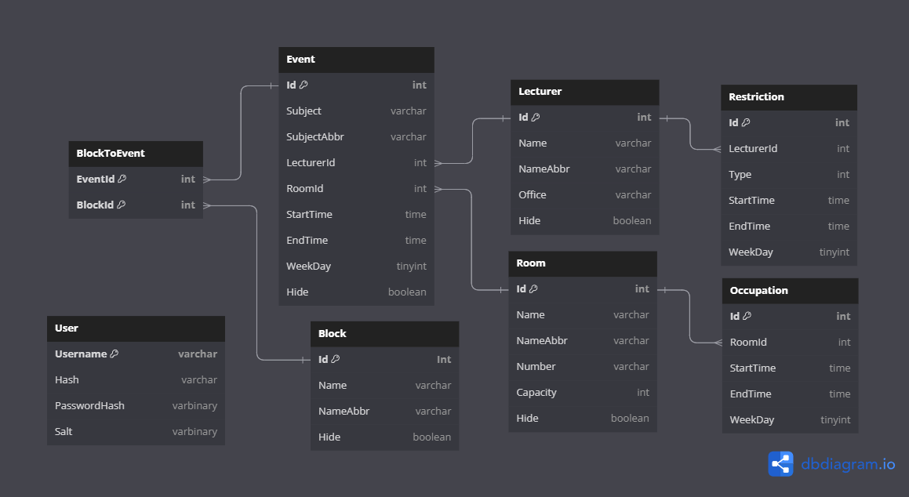

# schedule-backend

In this repository you can find the backend of the schedules app. This app is a simple timetabling app where you can add, edit and delete events. The backend is made with Flask and the database is made with Mysql. Additionally there exists a `migrate.py` script which is used to migrate the old access database to the new one.

The code responsible for the frontend part of the app can be found [here](https://github.com/luismdsleite/schedule).

## Database
The database is based on the old access databased used plus an aditional User table for authentication purposes. A few minor changes were made to the database to make it more suitable for the app. The database is made with Mysql and the schema can be found below.



### Creating the Database
The [schedule.sql](./Database/schedule.sql) file contains an sql script to create the database and the tables. By default the database will be named schedule.

 __**WARNING**__: The script will drop the database schedule if it already exists.

## FlaskAPI
The Flask API uses the `mysql.connector` library to connect to the database. Besides connection to the database, the API also handles authentication. The authentication is done with the `flask_jwt_extended` library to provide JWT tokens.

### Executing the API
To execute the API you need to have a `FlaskAPI/settings.json` file. Below can be found a template with the fields not filled up.

```json
{
    "config": {
        "common": {
            "HOST": "0.0.0.0",
            "PORT": 8008,
            "VERSION": "v1",
            "URL_PREFIX": "api",
            "DEFAULT_DEBUG": true,
            "THREADS_PER_PAGE": 2,
            "CSRF_ENABLED": true,
            "CSRF_SESSION_KEY": ""
        },
        "env": {
            "production": {
                "ENV": "production",
                "DEBUG": false,
                "DEVELOPMENT": false,
                "DATABASE_CONNECTION_OPTIONS": {
                    "DATABASE": "",
                    "DB_HOST": "",
                    "DB_PORT": "",
                    "DB_USER": "",
                    "DB_PASSWD": "",
                    "DB_NAME": "",
                    "CONNECT_TIMEOUT": 5,
                    "JWT_SECRET_KEY" : "",
                    "PEPPER": "",
                    "JWT_ACCESS_TOKEN_EXPIRES": 1440
                }
            },
            "development": {
                "ENV": "development",
                "DEBUG": true,
                "DEVELOPMENT": true,
                "DATABASE_CONNECTION_OPTIONS": {
                    "DATABASE": "",
                    "DB_HOST": "",
                    "DB_PORT": 3306,
                    "DB_USER": "",
                    "DB_PASSWD": "",
                    "DB_NAME": "",                    
                    "CONNECT_TIMEOUT": 5,
                    "JWT_SECRET_KEY" : "",
                    "PEPPER": "",
                    "JWT_ACCESS_TOKEN_EXPIRES": 1440
                }
            }
        }
    }
}
```

You must also have certificates in the `certs\` directory with a `cert.pem` and a `key.pem` file.

### Switching between Production and Development Mode
By default the API is in **Production Mode**, to access the Development Mode in the [app.py](./FlaskAPI/app.py) 
change the following line:

```python
from config import ProductionConfig as config # From this
from config import DevelopmentConfig as config # To this
```

After filling up the fields you can execute the API with the following command:

```bash
python app.py
```

### Registering the first user. 
To register new users you must make a POST request to the `/api/v1/auth/register` endpoint with the following body:

```json
{
    "username": "username",
    "password": "password"
}
```	
This endpoint **by default requires authentication** (to avoid access to anyone), so for creating your first user, you can either comment the `@jwt_required()` decorator in the `\register` route (on the [app.py](FlaskAPI/app.py)) and use the FlaskAPI to register your first user, or manually add an entry into the MySQL database.

## Migration
To migrate from the old DB to the new one follow these steps:

1. Convert the .mdb access file to csv files. This can be done by specialized apps like or with converters available online like [this one](https://www.rebasedata.com/convert-mdb-to-csv-online).
2. Store the csv tables in the `Migration/old_db` and create a `Migration/new_db` directory.
3. Create a `Migration/.env` file with the following fields:

```bash
DB_USER=""
DB_PASSWORD=""
DB_HOST=""
DB_NAME=""
```
4. On the `Migration/` directory execute the `migrate.py` script, this populate the new DB and also store the new tables in the `Migration/new_db` directory.

NOTE: the python package `mysql-connector-python` (v2.2.0) may require `--use-deprecated=legacy-resolver` flag in the `pip install` command.